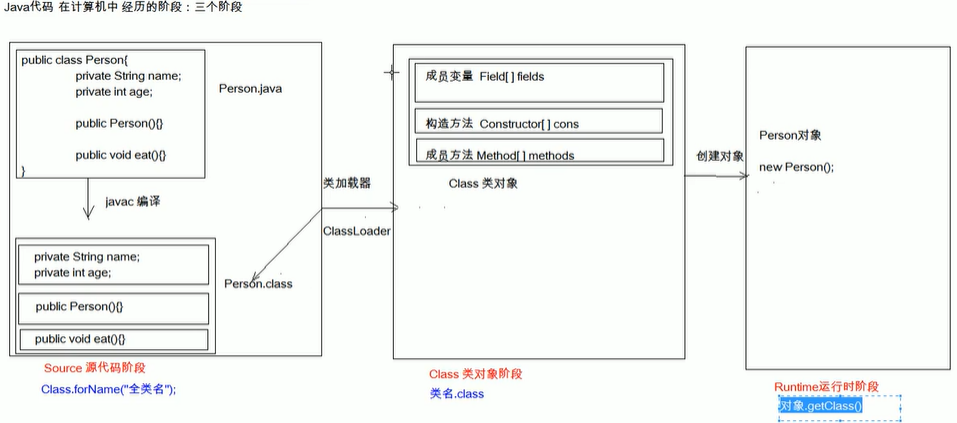
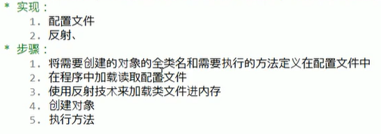
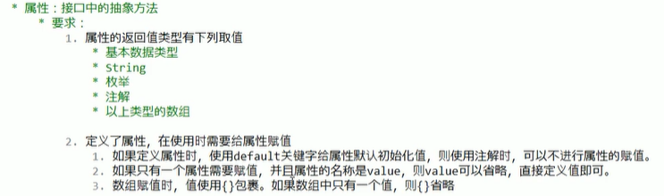
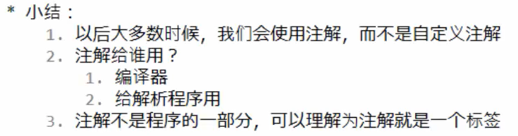

# JavaWebNotesHeima
## 1 Class and reflection
1. 获取字节码class对象的方式
同一个字节码文件*.class 只会被加载一次，无论哪一种方式获得的Class对象都是同一个
- Class.forName("full class name")
- ClassName.class
- ObjectName.getClass()

2. Class方法
- Field[] getFields() get all public fields
- Field getField(String name) get a public field by name
- Field[] getDeclaredFields() get all fields regardless of Modifier
- Field getDeclaredField() get field regardless of modifier
- 忽略访问权限修饰符的安全检查 暴力反射 Field d.setAccessible(true)
-----
- constructor newInstance()

---
- Method[] methods=personClass.getMethods();
-       Class p=Person.class;
        Method eat_m=p.getMethod("eat",String.class);
        Person person=new Person("Lida",21);
        eat_m.invoke(person," rice");
- method.setAccessible(true); 
---
3. Case - create a frame helping us have access to anything

   
## 2 Annotation @annotation
* [x] 代码分析 : analyze code [ use reflection]
* [x] 编写文档 : generate API doc
* [x] 编译检查 : override
1. most used Annotations
- @override : from father class?
- @Deprecated : outdated
- @SuppressWarnings : warning 传递参数 @SuppressWarning("all")
2. 自定义注解
* 格式:
  元注解 本质上为继承Annotation接口的接口
  public @interface 注解名称(){
  }
  
* attribute: abstract method defined in the interface
  1. return value of attribute
  * primitive data type
  * String
  * enum
  * all above
  2. give value to attribute if necessary
  * 如果用了default, 则不需赋值
  
    
3. 元注解 用于描述注解的注解
* @Target :describe the position annotation works
  * ElementType value:
    * Type : on class
    * METHOD: on method
    * FIELD: on member field
* @Retention  :describe the period annotation saved 注解保留的阶段
  * SOURCE
  * CLASS
  * RUNTIME
* @Documented :describe whether the annotation can be abstracted to api
  - if deleted , the anno will not appear in doc 
* @Inherited: describe the inheritance of annotation by child

4. 获取注解中定义的属性值
* 获取注解定义的位置的对象Class， Method， Field
* 获取指定的注解 getAnnotation(class)
* 调用注解中的抽象方法获取配置的属性值

5. 小结
